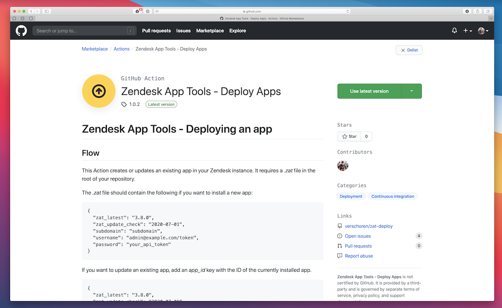

# Zendesk App Tools - Deploying an app

## About
This Action creates or updates an existing app in your Zendesk instance after a succesful commit in your GitHub repository.

Checkout the YouTube video below to see how it works:

## Flow
It requires a *.zat* file in the root of your repository. See [the Zendesk documentation](https://developer.zendesk.com/apps/docs/developer-guide/zat) for more info.

The *.zat* file should contain the following if you want to install a new app: 

    {
      "zat_latest": "3.8.0",
      "zat_update_check": "2020-07-01",
      "subdomain": "subdomain",
      "username": "admin@example.com/token",
      "password": "your_api_token"
    }

If you want to update an existing app, add an *app_id* key with the ID of the currently installed app.

    {
      "zat_latest": "3.8.0",
      "zat_update_check": "2020-07-01",
      "subdomain": "subdomaain",
      "username": "admin@example.com/token",
      "password": "your_api_token",
      "app_id": 123456
    }

## Usage
Below is an example flow to Deploy the app (either create or update) and store the resulting .zat file and app-xxx.zip as an artifact.

    name: Deploy Zendesk App

    on:
      push:
        branches: [ master ]

    jobs:
      build:
        runs-on: ubuntu-latest

        steps:
        - uses: actions/checkout@v2

        - name: ZAT Deploy
          uses: verschoren/zat-update@master

        - name: Archive App Package
          uses: actions/upload-artifact@v1
          with:
           name: packaged_app
           path: tmp

        - name: Archive .zat file
          uses: actions/upload-artifact@v1
          with:
           name: .zat
           path: .zat

You can use the 2 artifacts to create releases in your GitHub repo, or to keep the .zat file in sync with your Zendesk instance.

## Create or Update
If you have never deployed the app, you'll need to run the Action once, and retrieve the *.zat* artifact from the workflow.
This file contains the app_id needed to update the app the next time the app runs. You can replace your existing file with the newly generated *.zat* file.

## Dependencies
1. The action uses docker: *verschoren/zendesk_zat:latest*
2. It then uses the entrypoint.sh to run *zat create* OR *zat update*
3. You can use Artifacts to retrieve the packaged file from /tmp 
